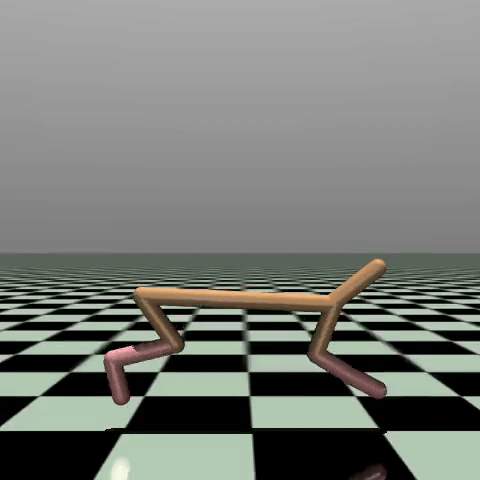
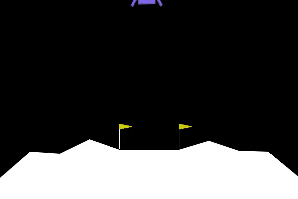
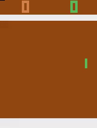
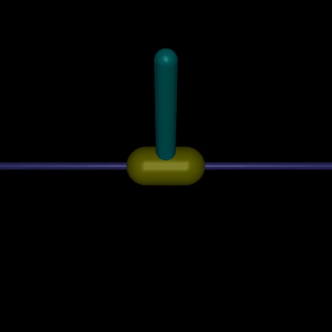
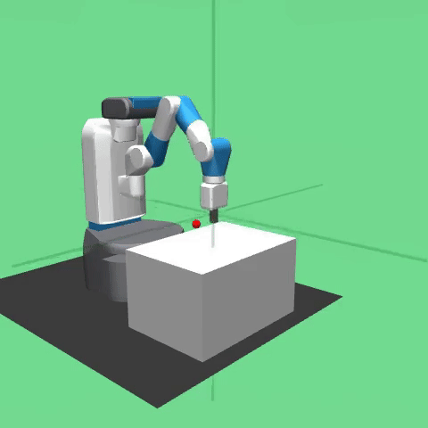
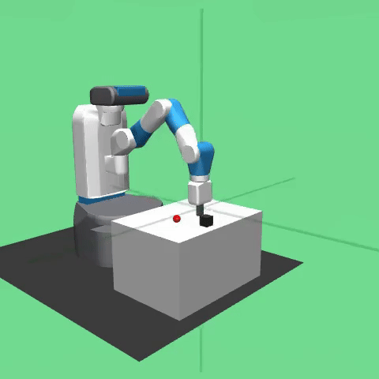
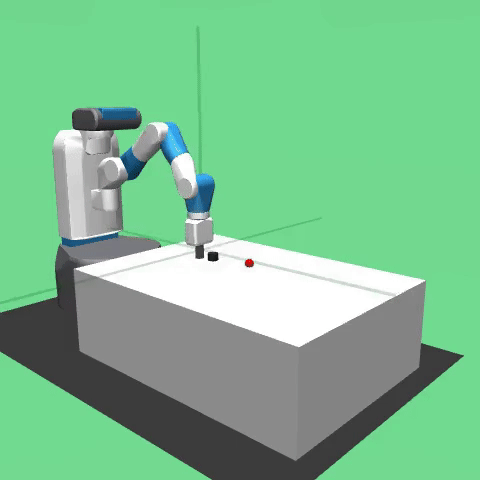
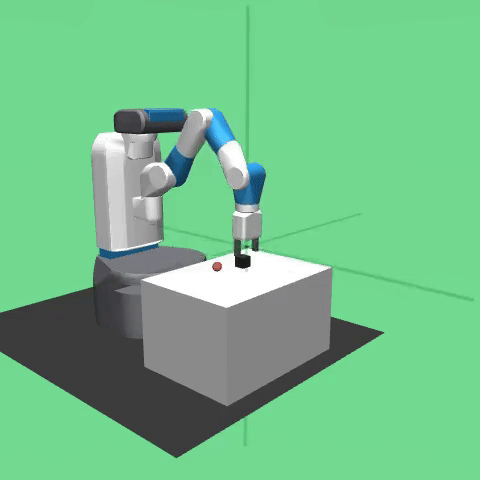

# PhoenX RL


<table>
  <tr>
    <td></td>
    <td></td>
    <td></td>
    <td></td>
  </tr>
  <tr>
    <td></td>
    <td></td>
    <td></td>
    <td></td>
  </tr>
</table>

## Overview
PhoenX RL is a flexible, modular reinforcement learning (RL) framework designed for rapid experimentation and development of RL agents. Built on PyTorch, it supports a variety of on-policy and off-policy algorithms, integrates seamlessly with Gymnasium environments, and includes tools for distributed training with Ray, hyperparameter sweeps, intrinsic curiosity, N-step returns, and visualization via Dash and Weights & Biases (WandB).
The framework emphasizes extensibility, allowing users to customize models, noise processes, normalizers, schedulers, buffers, and callbacks. It is suitable for both research and practical applications in robotics, games, and control tasks, with support for goal-oriented learning and distributed scaling.

## Key Features
- **Supported Algorithms:**
   - **On-Policy**: Reinforce, Actor-Critic, Proximal Policy Optimization (PPO) with adaptive KL divergence.
   - **Off-Policy**: Deep Deterministic Policy Gradient (DDPG), Twin Delayed DDPG (TD3), Soft Actor-Critic (SAC).
   - **Goal-Oriented**: Hindsight Experience Replay (HER) with DDPG/TD3 backends (adding SAC backend support).
- **Modular Components:**
   - **Models**: Stochastic policies (discrete/continuous), value functions, actors, and critics with customizable layers (dense, conv, etc...) and initializers.
   - **Noise Processes**: Ornstein-Uhlenbeck (OU), Normal, Uniform noise for exploration, with optional scheduling.
   - **Normalizers**: Running statistics for observations/actions/goals, with shared memory support in distributed settings.
   - **Schedulers**: Learning rate and parameter schedulers (linear, step, cosine annealing, exponential).
   - **Buffers**: Standard ReplayBuffer, PrioritizedReplayBuffer (proportional or rank-based), with N-step return support and trajectory tracking.
   - **Intrinsic Curiosity Module (ICM)**: For exploration in sparse-reward environments.
   - **Callbacks**: WandB integration for logging, metrics, and artifact saving; extensible for custom hooks, with distributed variants.
- **Distributed Training**: Ray-based actors for learners and workers, with shared buffers and normalizers for scalable Off-Policy methods and synchronization intervals.
- **Hyperparameter Optimization**: WandB sweeps for automated tuning. (replacing with Ray Tune)
- **UI and Visualization**: Dash-based web interface for building agents, training/testing, hyperparameter search, and co-occurrence analysis.
- **Environment Support**: Gymnasium Env wrapper (for custom Gymnasium Env integration), with plans for Isaac Sim integration in the near future.

## Installation
PhoenX RL can be installed and run either using Docker (recommended for reproducible environments and GPU support) or locally with Conda. The project uses Miniconda for dependency management.
### Option 1: Using Docker (Recommended for Development)
1. **Clone the Repository**:
~~~bash
git clone https://github.com/yourusername/phoenx-rl.git
cd phoenx-rl
~~~
2. **Build the Docker Image**:
The Dockerfile sets up CUDA 12.6, installs Miniconda, creates a Conda environment from `environment.yml`, and installs additional dependencies.
~~~bash
docker build -t phoenx-rl -f Dockerfile .
~~~
3. **Run the Docker Container**:
Run the container with GPU support, mounting your project directory and exposing ports for WandB (8080) Dash (8050) and Ray dashboard (8265)
~~~bash
docker run --gpus all --shm-size=10.24gb -p 8050:8050 -p 8265:8265 -v $(pwd)/src:/app phoenx-rl
~~~
- For VS Code Dev Containers: Open the project in VS Code with the Dev Containers extension. It will use `.devcontainer/devcontainer.json` to build and configure the environment automatically.
### Option 2: Local Installation with Conda
1. **Clone the Repository**:
```bash
git clone https://github.com/yourusername/phoenx-rl.git
cd phoenx-rl
```
2. **Install Miniconda** (if not already installed): Download and install from [Miniconda](https://www.anaconda.com/docs/getting-started/miniconda/main).
3. **Create and Activate the Conda Environment**: Use the provided `environment.yml` to set up dependencies:
```bash
conda env create -f src/environment.yml
conda activate rl_env
```
4. **Install PyTorch with CUDA (Optional for GPU)**: If you have CUDA installed:
```bash
pip install torch==2.4.0 torchvision==0.19.0 torchaudio==2.4.0 --index-url https://download.pytorch.org/whl/cu124
```
For CPU-only:
```bash
pip install torch torchvision torchaudio
```
5. **Install Gymnasium Robotics**:
```bash
pip install git+https://github.com/Farama-Foundation/Gymnasium-Robotics.git@v1.4.0
```
6. **Accept Atari ROM License (for Atari environments)**:
```bash
AutoROM --accept-license --install-dir $(conda info --base)/envs/rl_env/lib/python3.12/site-packages/ale_py/roms
```

## Usage
### Building and Training an Agent (W/O using Dash app)
1. **Configure the Agent**:
Create JSON configs for the agent and training parameters (e.g., `agent_config.json`, `train_config.json`).

   Example for HER with DDPG backend using N-step, ICM, and schedulers for Actor/Critic learning rate and ICM rewards:
```python
# Set device
device = 'cuda'

# Create env with NStepReward wrapper
N = 1 # N-steps
env = gym.make('FetchPush-v4')
wrappers = [
    {
        "type": "NStepReward",
        "params": {
            "n": N
        }
    }
]
env_spec = env.spec
env_wrap = GymnasiumWrapper(env_spec, wrappers)

# Create LR scheduler for Actor and Critic models
scheduler_config = {
   "type": "linear",
   "params": {
      "start_factor": 1.0,
      "end_factor": 0.1,
      "total_iters": 1000000
   }
}
scheduler = ScheduleWrapper(scheduler_config)

# Build actor
actor_optimizer = {'type': 'Adam','params': { 'lr': 0.001 }}

layer_config = [
    {'type': 'dense', 'params': {'units': 64, 'kernel': 'variance_scaling', 'kernel params':{"scale": 1.0, "mode": "fan_in", "distribution": "uniform"}}},
    {'type': 'relu'},
    {'type': 'dense', 'params': {'units': 64, 'kernel': 'variance_scaling', 'kernel params':{"scale": 1.0, "mode": "fan_in", "distribution": "uniform"}}},
    {'type': 'relu'},
    {'type': 'dense', 'params': {'units': 64, 'kernel': 'variance_scaling', 'kernel params':{"scale": 1.0, "mode": "fan_in", "distribution": "uniform"}}},
    {'type': 'relu'},
]
output_layer_config = [{'type': 'dense', 'params': {'kernel': 'uniform', 'kernel params':{'a':-3e-3, 'b':3e-3}}}]

actor = ActorModel(env_wrap, layer_config, output_layer_config, actor_optimizer, scheduler, device=device)

# Build critic
critic_optimizer = {'type': 'Adam','params': { 'lr': 0.001 }}

state_layer_config = [

] # Only observations are passed through state layer configs

merged_layer_config = [
    {'type': 'dense', 'params': {'units': 64, 'kernel': 'variance_scaling', 'kernel params':{"scale": 1.0, "mode": "fan_in", "distribution": "uniform"}}},
    {'type': 'relu'},
    {'type': 'dense', 'params': {'units': 64, 'kernel': 'variance_scaling', 'kernel params':{"scale": 1.0, "mode": "fan_in", "distribution": "uniform"}}},
    {'type': 'relu'},
    {'type': 'dense', 'params': {'units': 64, 'kernel': 'variance_scaling', 'kernel params':{"scale": 1.0, "mode": "fan_in", "distribution": "uniform"}}},
    {'type': 'relu'},
] # Actions are concatenated with state layer config output (if present)

critic = CriticModel(env_wrap, state_layers=state_layer_config, merged_layers=merged_layer_config,
                    output_layer_kernel=output_layer_config, optimizer_params=critic_optimizer, lr_scheduler=scheduler, device=device)

# Create replay buffer
replay_buffer = ReplayBuffer(env_wrap, 1000000, goal_shape=env.observation_space['desired_goal'].shape, N=N, device='cpu')
# replay_buffer = PrioritizedReplayBuffer(env_wrap, 1000000, beta_start=0.4, beta_iter=100000, beta_update_freq=1, priority='rank',normalize=False, goal_shape=env.observation_space['desired_goal'].shape, epsilon=0.01, N=N, device='cpu'

# Create noise object with optional scheduler
noise = NormalNoise(shape=env_wrap.action_space.shape, mean=0.0, stddev=0.1, device=device)
# schedule_config = {'type':'linear', 'params':{'start_factor':1.0, 'end_factor':0.1, 'total_iters':10000}}
# noise_schedule = ScheduleWrapper(schedule_config)
noise_schedule = None

# Build ICM model
# optimizer_params = {'type': 'Adam', 'params': {'lr': 1e-3}}

model_configs = {
    # 'encoder': { # Optional encoder
    #     'layer_config': [
    #         {'type': 'dense', 'params': {'units': 64, 'kernel': 'variance_scaling', 'kernel params':{"scale": 1.0, "mode": "fan_in", "distribution": "uniform"}}},
    #         {'type': 'relu'},
    #     ],
    #     'output_layer': [
    #         {'type': 'dense', 'params': {'units': 256, 'kernel': 'variance_scaling', 'kernel params':{"scale": 1.0, "mode": "fan_in", "distribution": "uniform"}}}
    #     ]
    # },
    'inverse_model': {
        'layer_config': [
            {'type': 'dense', 'params': {'units': 64, 'kernel': 'xavier_uniform', 'kernel params':{"gain": 2.0}}},
            {'type': 'relu'},
        ],
        'output_layer': [
            {'type': 'dense', 'params': {'kernel': 'xavier_uniform', 'kernel params':{"gain": 2.0}}}
        ]
    },
    'forward_model': {
        'layer_config': [
            {'type': 'dense', 'params': {'units': 64, 'kernel': 'xavier_uniform', 'kernel params':{"gain": 2.0}}},
            {'type': 'relu'},
        ],
        'output_layer': [
            {'type': 'dense', 'params': {'kernel': 'xavier_uniform', 'kernel params':{"gain": 2.0}}}
        ]
    }
}

schedule_config = {'type':'linear', 'params':{'start_factor':1.0, 'end_factor':0.1, 'total_iters':10000}}
scheduler = ScheduleWrapper(schedule_config)

icm = ICM(env_wrap, model_configs, optimizer_params, reward_weight=0.2, reward_scheduler=scheduler, beta=0.2, extrinsic_threshold=10000, warmup=1000, device=device)

# Create DDPG agent
ddpg_agent = DDPG(env=env_wrap,
                actor_model=actor,
                critic_model=critic,
                replay_buffer=replay_buffer,
                discount=0.98,
                tau=0.01,
                action_epsilon=0.2,
                batch_size=512,
                noise=noise,
                noise_schedule=noise_schedule,
                grad_clip=None,
                warmup=1000,
                N=N,
                curiosity=icm,
                callbacks=[rl_callbacks.WandbCallback('FetchPush-v4')],
                save_dir='FetchPush_N1_Curious_Pre_intrinsic',
                device=device)

# Create HER object
her = HER(
    agent=ddpg_agent,
    strategy='future',  
    tolerance=0.05,
    num_goals=4,
    save_dir='FetchPush_N1_Curious_Pre_intrinsic',
)

her.save() # Save object to create agent config

# Create train config
config = her.get_config()

# Set train config and path
train_config = {
    'num_epochs': 200,
    'num_cycles': 50,
    'num_episodes': 16,
    'num_updates': 40,
    'num_envs': 16,
    'seed': 42,
    'render_freq': 500,
}
train_config_path = config["save_dir"] + 'train_config.json'
with open(train_config_path, 'w') as f:
    json.dump(train_config, f)
```
2. **Train**:
   
 Command Line
```bash
python train.py --agent_config agent_config.json --train_config train_config.json
```
   Distributed Train
```bash
python train.py --agent_config agent_config.json --train_config train_config.json --distributed_workers 4
```
   Programatically
```python
from agent_utils import load_agent_from_config

agent = load_agent_from_config(config)
agent.train(**train_config)

# Distributed
from distributed_trainer import DistributedAgents

distributed_agents = DistributedAgents(config, num_workers=4)
distributed_agents.train(**train_config)
```

### Dash UI
   Launch the Dash app for interactive agent building/training:
```bash
python dashboard.py
```

# Roadmap
PhoenX RL is actively evolving. Future plans include:
- **Isaac Sim Integration**: Adding support for NVIDIA Isaac Sim environments to enable advanced robotics simulations and real-world transfer learning.
- **Ray Tune for Hyperparameter Optimization**: Incorporating Ray Tune to leverage advanced search algorithms (e.g., Bayesian optimization, HyperBand) for more efficient hyperparameter tuning.
- **Transformer Layers Support**: Extending the model architecture to include transformer layers for handling sequential data in RL tasks, such as in partially observable environments or long-horizon planning.

# License
This project is licensed under the MIT License - see the LICENSE file for details.
