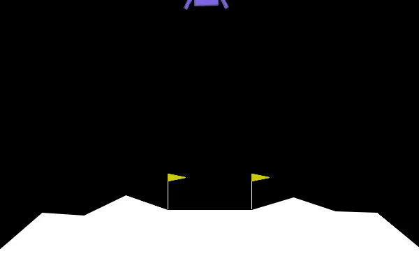
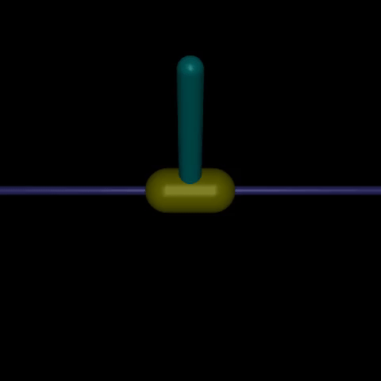
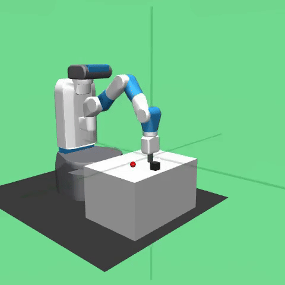
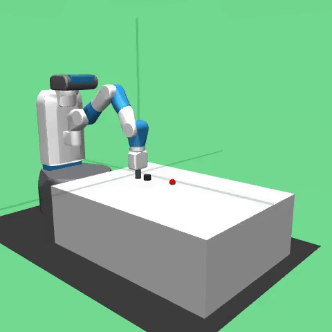
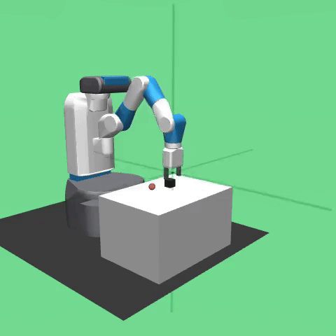

# PhoenX RL


<table>
  <tr>
    <td></td>
    <td></td>
    <td></td>
    <td></td>
  </tr>
  <tr>
    <td></td>
    <td></td>
    <td></td>
    <td></td>
  </tr>
</table>

## Overview
PhoenX RL is a flexible, modular reinforcement learning (RL) framework designed for rapid experimentation and development of RL agents. Built on PyTorch, it supports a variety of on-policy and off-policy algorithms, integrates with Gymnasium and IsaacSim environments, and includes components like intrinsic curiosity, N-step returns, replay buffers, schedulers, normalizers, and optional experiment logging via Weights & Biases (WandB).

The framework emphasizes extensibility, allowing users to customize models, noise processes, buffers, and callbacks. It is suitable for both research and practical applications in robotics, games, and control tasks, with support for goal-oriented learning and scaling.

## Key Features
- **Supported Algorithms:**
   - **On-Policy**: Reinforce, Actor-Critic, Proximal Policy Optimization (PPO) with adaptive KL divergence.
   - **Off-Policy**: Deep Deterministic Policy Gradient (DDPG), Twin Delayed DDPG (TD3), Soft Actor-Critic (SAC).
   - **Goal-Oriented**: DDPG, TD3, SAC, PPO, Hindsight Experience Replay (HER) with DDPG/TD3/SAC backends.
- **Modular roots → trunk → branches networks:** every agent is built on a
  composite `ModularModel` — user-named per-modality encoder **roots**, an
  optional shared **trunk** (the single place temporal layers may live), and
  per-role **branches** (policy / value / critic heads). Per-module optimizers
  with research-backed gradient ownership: on-policy agents combine losses into
  ONE backward + coordinated step (SB3 / RSL-RL standard); off-policy agents
  let the critic loss own the shared body while the policy trains on detached
  features (SAC-AE / DrQ-v2 standard).

- **Multi-modal observations:** Dict observation spaces (e.g. camera +
  proprioception) flow end to end — env wrappers, every buffer, per-key
  `DictNormalizer`/`ImageScale` normalizers, HER, and intrinsic motivation —
  with uint8 image storage and per-root `input_keys` routing.
- **Temporal policies:** LSTM/GRU trunks (recurrent PPO/ActorCritic with
  sequence minibatching and masked mid-sequence resets; recurrent
  SAC/TD3/DDPG with R2D2-style stored initial hidden + optional burn-in) and
  causal-transformer trunks with rolling context-window inference.
- **Modular Components:**
   - **Models**: Head classes (stochastic discrete/continuous policies, deterministic actors, value and Q heads) with a data-driven layer registry (dense, conv1d/2d/3d, pooling, norms, activations, embeddings, attention, transformer encoders, LSTM/GRU) and per-layer weight initializers.
   - **Noise Processes**: Ornstein-Uhlenbeck (OU), Normal, Uniform noise for exploration, with optional scheduling.
   - **Normalizers**: Running statistics for observations/actions/goals, per-key Dict normalizers, image scaling.
   - **Schedulers**: Learning rate and parameter schedulers (linear, step, cosine annealing, exponential), attachable per module.
   - **Buffers**: Standard ReplayBuffer, PrioritizedReplayBuffer (proportional or rank-based), with N-step return support, trajectory tracking, and R2D2 stored-state support.
   - **Intrinsic Curiosity Module (ICM)**: For exploration in sparse-reward environments.
   - **Callbacks**: WandB integration for logging, metrics, and artifact saving; extensible for custom hooks, with distributed variants.
- **Experiment Logging**: Optional Weights & Biases (WandB) callback support for metrics/logging and artifact saving.
- **Environment Support**: Gymnasium and IsaacSim

## Installation
PhoenX installs with conda + pip. Two modes share the same order; Isaac Lab mode inserts one extra command. Full detail, extras, and troubleshooting: [`installation.md`](installation.md).

### Gymnasium mode (~5 min)
```bash
conda create -n phoenx python=3.11
conda activate phoenx
pip install --upgrade pip
pip install -U torch==2.7.0 torchvision==0.22.0 --index-url https://download.pytorch.org/whl/cu128
conda install -y -c conda-forge swig
pip install -e ".[dev,docs]"
```

### Isaac Lab mode (~30-60 min)
```bash
conda create -n phoenx python=3.11
conda activate phoenx
pip install --upgrade pip
pip install "isaaclab[isaacsim,all]==2.3.2.post1" --extra-index-url https://pypi.nvidia.com
pip install -U torch==2.7.0 torchvision==0.22.0 --index-url https://download.pytorch.org/whl/cu128
conda install -y -c conda-forge swig
pip install -e ".[dev,docs]"
```

On Windows, SWIG from conda-forge is required before the final `pip install`
(no cp311 wheel for `box2d-py`; do not use `pip install swig` — that shim
fails under pip's build isolation). `setup.ps1` installs SWIG for you.

No-clone: replace the final line with
`pip install "phoenx-rl @ git+https://github.com/jasonhayes1987/PhoenX_RL.git"`.

### Quick start (Windows / PowerShell)
```powershell
git clone https://github.com/jasonhayes1987/PhoenX_RL.git
cd PhoenX_RL
.\setup.ps1
```

`.\setup.ps1 -Isaac -Docs` installs everything (including SWIG). See
`installation.md` for switches.

## Usage
Training is driven by a YAML config. At least one of `--config` or `--agent_dir`
is required; if both are passed, `--config` wins. Console entry points: `phoenx-train` and `phoenx-test`
(`python -m phoenx.cli.train` also works).

### Bundled example configs
Four portable examples ship inside the package (relative `save_dir` values):

- `LunarLander-v3/reinforce.yml`
- `LunarLanderContinuous-v3/ppo.yml`
- `LunarLanderContinuous-v3/sac.yml`
- `IsaacSim/franka/cube_lift/dense/ppo_camera.yml`

An existing on-disk path always wins; otherwise a relative `--config` is looked
up among the bundled examples. Works with no clone:

```bash
pip install "phoenx-rl @ git+https://github.com/jasonhayes1987/PhoenX_RL.git"
phoenx-train --config LunarLanderContinuous-v3/sac.yml
```

Keep your own configs anywhere on disk and pass a path when you need something
beyond the bundled set.

### Train from a config
```bash
phoenx-train --config LunarLanderContinuous-v3/sac.yml
phoenx-train --config path/to/my_experiment.yml
```

### Resume from a saved agent directory
```bash
phoenx-train --agent_dir path/to/saved/agent_dir
```

Optional: `--log_level INFO` (or any standard level).

### Evaluate a trained agent
```bash
phoenx-test --agent_dir path/to/saved/agent_dir
```

`phoenx-test` also accepts `--num_episodes`, `--num_envs`, `--render_mode`,
`--env`, `--seed`, and `--log_level`.

# Roadmap
PhoenX RL is actively evolving. Future plans include:
- **MARL**: Adding Multi-Agent variants for DDPG, TD3, PPO, and SAC
- **HRL**: Adding Hierarchical Reinforcement Learning support (Most likely through Ray RLib)

# License
This project is licensed under the MIT License - see the LICENSE file for details.
