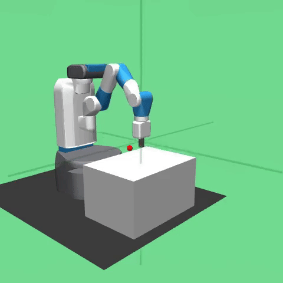

# PhoenX RL


<table>
  <tr>
    <td></td>
    <td></td>
    <td></td>
    <td></td>
  </tr>
  <tr>
    <td></td>
    <td></td>
    <td></td>
    <td></td>
  </tr>
</table>

## Overview
PhoenX RL is a flexible, modular reinforcement learning (RL) framework designed for rapid experimentation and development of RL agents. Built on PyTorch, it supports a variety of on-policy and off-policy algorithms, integrates with Gymnasium environments, and includes components like intrinsic curiosity, N-step returns, replay buffers, schedulers, normalizers, and optional experiment logging via Weights & Biases (WandB).

The framework emphasizes extensibility, allowing users to customize models, noise processes, buffers, and callbacks. It is suitable for both research and practical applications in robotics, games, and control tasks, with support for goal-oriented learning and scaling (Ray-based distributed training support exists in the codebase but is still evolving).

## Key Features
- **Supported Algorithms:**
   - **On-Policy**: Reinforce, Actor-Critic, Proximal Policy Optimization (PPO) with adaptive KL divergence.
   - **Off-Policy**: Deep Deterministic Policy Gradient (DDPG), Twin Delayed DDPG (TD3), Soft Actor-Critic (SAC).
   - **Goal-Oriented**: DDPG, TD3, SAC, PPO.
   - **Hindsight Experience Replay (HER)**: DDPG/TD3/SAC backends.
- **Modular Components:**
   - **Models**: Stochastic policies (discrete/continuous), value functions, actors, and critics with customizable layers (dense, conv, etc...) and initializers.
   - **Noise Processes**: Ornstein-Uhlenbeck (OU), Normal, Uniform noise for exploration, with optional scheduling.
   - **Normalizers**: Running statistics for observations/actions/goals, with shared memory support in distributed settings.
   - **Schedulers**: Learning rate and parameter schedulers (linear, step, cosine annealing, exponential).
   - **Buffers**: Standard ReplayBuffer, PrioritizedReplayBuffer (proportional or rank-based), with N-step return support and trajectory tracking.
   - **Intrinsic Curiosity Module (ICM)**: For exploration in sparse-reward environments.
   - **Callbacks**: WandB integration for logging, metrics, and artifact saving; extensible for custom hooks, with distributed variants.
- **Experiment Logging**: Optional Weights & Biases (WandB) callback support for metrics/logging and artifact saving.
- **Environment Support**: Gymnasium and IsaacSim

## Installation
PhoenX RL is designed to be installed locally via Conda + Poetry. The recommended path is to run the provided PowerShell setup script after cloning.

See `installation.md` for the full, up-to-date instructions.

### Quick start (Windows / PowerShell)
```bash
git clone <your-repo-url>
cd PhoenX_RL
.\setup.ps1
```

## Usage
PhoenX RL uses a simple two-step workflow:

1. **Create an agent directory from a YAML config** (writes `config.json`, `train_config.json`, and `test_config.json` into `save_dir`)
2. **Train using `train.py` by pointing at that saved directory**

### 1) Edit a YAML config
Configs live in `src/Configs/`. The ones currently wired up to the YAML build scripts are:
- `src/Configs/reinforce.yml`
- `src/Configs/actor_critic.yml`
- `src/Configs/ddpg.yml`

Update at least:
- `save_dir`: where the agent + train/test configs will be written (recommended: change this to a path on your machine)
- `env`: environment type/config
- `device`: `"cuda"` or `"cpu"`

### 2) Build/save the agent from the YAML config
```bash
python src/scripts/reinforce.py --config_file src/Configs/reinforce.yml
python src/scripts/actor_critic.py --config_file src/Configs/actor_critic.yml
python src/scripts/ddpg.py --config_file src/Configs/ddpg.yml
```

### 3) Train from the saved agent directory
```bash
python src/scripts/train.py --agent_dir "path/to/your/saved/agent_dir"
```

You can override some training options from the CLI (for example `--render_freq`, `--num_episodes`, etc.); otherwise `train.py` reads them from `train_config.json` in the agent directory.

# Roadmap
PhoenX RL is actively evolving. Future plans include:
- **Ray Tune for Hyperparameter Optimization**: Incorporating Ray Tune to leverage advanced search algorithms (e.g., Bayesian optimization, HyperBand) for more efficient hyperparameter tuning.
- **Expanded YAML Config Coverage**: Adding/standardizing YAML configs for PPO/SAC/HER and updating their script entrypoints to use the configs.
- **MARL**: Adding Multi-Agent variants for DDPG, TD3, PPO, and SAC
- **HRL**: Adding Hierarchical Reinforcement Learning support (Most likely through Ray RLib)
- **Transformer Layers Support**: Extending the model architecture to include transformer layers for handling sequential data in RL tasks, such as in partially observable environments or long-horizon planning.

# License
This project is licensed under the MIT License - see the LICENSE file for details.
